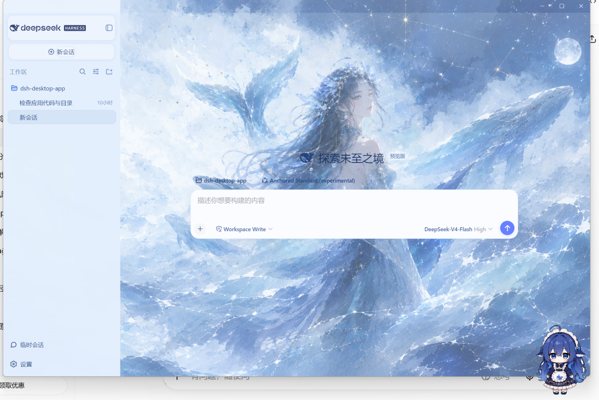

<div align="center">

# DeepSeek Harness · beautiful desktop

基于 DeepSeek Harness 的个性化界面设计项目，围绕沉浸式 AI 工作体验进行视觉重构。融合冰雪星空背景、毛玻璃 UI、极简工作区与 AI 助手元素，在保留原有功能逻辑的基础上，打造更具个性与沉浸感的 AI Agent 桌面界面。



</div>

---

## ✨ 视觉特性

- ❄️ **冰雪星空背景** — 梦幻插画级全屏背景（星空 / 月亮 / 鲸鱼），冷色调沉浸氛围
- 🧊 **毛玻璃 UI** — 侧边栏与面板半透明毛玻璃效果，柔和自然
- 🎨 **极简工作区** — 简洁布局，文字清晰不重叠，白卡片 + 浅色文字高可读性
- 🤖 **AI 助手元素** — 桌宠（dsh-pet）+ 大肥鱼桌面伴侣 + 88 条互动台词
- 🚀 **沉浸式体验** — 无边框窗口、双击全屏、灵动加载动画（2-3 秒）
- 🛡️ **功能零损失** — 所有原始功能逻辑保留：插件管理、插件选择向导、防回归验证

## 📦 项目结构

```
├── dsh-desktop-app/       # Electron 桌面客户端（主进程 + 窗口控制 + 构建脚本）
├── dsh-glass-workspace/   # 玻璃拟态主题插件（CSS 层 + 客户端主题 + 设置卡片）
└── dsh-desktop-app-share.tar.gz  # 纯源码分享包（29 文件，排除 node_modules/dist）
```

## ⬇️ 下载

### 完整版一体包（推荐 · 解压即用）

> 📥 **[DeepSeek-Harness-Complete.tar.gz（Release 附件）](https://github.com/hernandezlisauclby2904-rgb/DeepSeek-Harness-beautiful-desktop/releases/latest/download/DeepSeek-Harness-Complete.tar.gz)** — 约 280MB 压缩包，内含：
> - Electron 壳（DeepSeek Harness.exe）+ 完整 DSH 运行时（含全部插件：玻璃主题 / 桌宠 / 大肥鱼等）
> - **已排除个人数据**：无 API 密钥、无会话记录、无 user-data，首次启动自行配置
>
> **使用方法**：
> 1. 下载并解压（建议用 7-Zip / WinRAR 解压 .tar.gz）
> 2. 双击 `DeepSeek Harness.exe`
> 3. 首次启动配置 API Key 即可使用
>
> *便携模式：运行时跟随 exe 同级 `.dsh` 目录，解压到任意位置（U盘/移动硬盘）均可运行，不写入用户主目录。*

### 源码版

- `dsh-desktop-app/` — 源码，需 Node.js >= 18 自行构建（见下）
- `dsh-desktop-app-share.tar.gz` — 纯源码分享包

## 🚀 快速开始

```bash
cd dsh-desktop-app
npm install
npm start
```

## 🔨 构建安装包

```bash
cd dsh-desktop-app
npm run build           # NSIS 安装包 + 便携版
npm run build:portable  # 仅便携版
```

构建产物位于 `dsh-desktop-app/dist/` 目录（安装包 + 便携版 + win-unpacked）。

> 构建后自动运行 `scripts/verify-build.js`（11 项防回归检查）。

## 🎨 主题配置

主题参数可在 Settings > 玻璃拟态工作区 调整，或编辑 `~/.dsh/glass-workspace.json`：

| 参数 | 默认值 | 说明 |
|------|--------|------|
| `background.image` | bg-default.png | 背景图片（assets 文件名 / 本机路径 / URL） |
| `background.overlay` | 0.05 | 浅色遮罩强度 0~1 |
| `glass.blur` | 14 | UI 毛玻璃强度 px |
| `glass.sidebarAlpha` | 0.72 | 侧栏透明度 |
| `glass.radius` | 16 | 圆角 px |

## ⚙️ 环境要求

- Node.js >= 18
- Windows 10/11

## 📄 License

MIT
